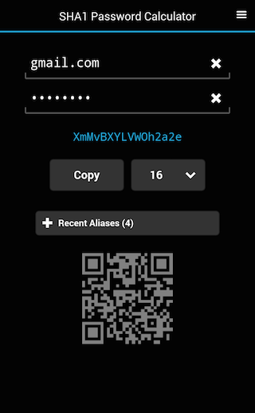

# pwcalc-mobile

Mobile app to calculate strong cryptographic passwords.





Available on the [Google Play Store](
https://play.google.com/store/apps/details?id=de.pmorjan.TPSM
)
and on the [Chrome Web Store](
https://chrome.google.com/webstore/detail/gfdaokhcoidlgljipinbbcafapmmdanb
).

Passwords are calculated like this:
````
password = secret word + alias | SHA1 | Base64
````
You chose a single secret and an alias for the service the password is needed for.
E.g:
````
mysecret + gmail.com
````
This is combined to a single string
````
mysecretgmail.com
````
Next the cryptographic hash function SHA1 is applied to this compound word.
It produces a 160-bit hash value typically rendered  as hexadecimal number:
````
5e63 2f05 760b 5563 a1d9 ad9e e555 540d 7c19 9c65
````

These 40 digits are then taken as (binary) input for the
Base64 function which produces the password:

````
XmMv BXYL VWOh 2a2e 5VVU DXwZ nGU=
````
This unique password cannot by any means be traced back to the secret word or alias.


In plain Linux the password can be calculated like this:
````
   echo -n "mysecretgmail.com" \
       | sha1sum \
       | xxd -r -p \
       | base64
    XmMvBXYLVWOh2a2e5VVUDXwZnGU=
````

# Instructions to build Pwcalc for Android

This app is made with the Apache Cordova framework.
See https://cordova.apache.org/ for details.

clone pwcalc-mobile:
```
git clone https://github.com/pmorjan/pwcalc-mobile.git
```
build a Cordova skeleton:
```
cordova create dummy com.example.myPwcalc myPwcalc
```
merge the Cordova skeleton into the myPwcalc directory:
```
cp -af dummy/{hooks,platforms,plugins,res,config.xml} myPwcalc/
```
build the application
```
cd myPwcalc
cordova platform add android
cordova plugins add com.verso.cordova.clipboard
cordova plugins add uk.co.whiteoctober.cordova.appversion
cordova plugins add nl.x-services.plugins.socialsharing
cordova build
```

